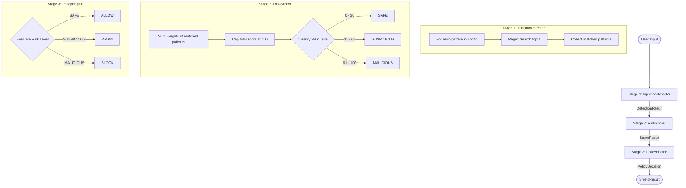

# Phase 1 Architecture — Prompt Shield

> **Phase:** 1.0 | **Approach:** Rule-Based Pattern Detection

---

## Overview

Phase 1 implements a three-stage pipeline that scans user input for known prompt injection attack phrases and enforces a configurable security policy.

```
User Input
    │
    ▼
┌───────────────────────────────────────┐
│         Stage 1: InjectionDetector    │
│                                       │
│  For each pattern in config:          │
│  • re.compile(pattern, IGNORECASE)    │
│  • regex.search(user_input)           │
│  • Collect all matches                │
│                                       │
│  Returns: DetectionResult             │
│    detected: bool                     │
│    matched_patterns: List[str]        │
└──────────────────┬────────────────────┘
                   │
                   ▼
┌───────────────────────────────────────┐
│         Stage 2: RiskScorer           │
│                                       │
│  raw_score = Σ weight(pattern)        │
│  score = min(raw_score, 100)          │
│  risk_level = classify(score)         │
│                                       │
│  Thresholds:                          │
│    0–30  → SAFE                       │
│    31–60 → SUSPICIOUS                 │
│    61–100→ MALICIOUS                  │
│                                       │
│  Returns: ScoreResult                 │
│    score: int                         │
│    risk_level: str                    │
└──────────────────┬────────────────────┘
                   │
                   ▼
┌───────────────────────────────────────┐
│         Stage 3: PolicyEngine         │
│                                       │
│  SAFE       → ALLOWED                 │
│  SUSPICIOUS → WARNED                  │
│  MALICIOUS  → BLOCKED                 │
│                                       │
│  Returns: PolicyDecision              │
│    status: str                        │
│    reason: str                        │
└──────────────────┬────────────────────┘
                   │
                   ▼
              ShieldResult
    status / risk_score / risk_level
    reason / detected / matched_patterns
```

### Pipeline Flow (Mermaid Diagram)




---

## Pattern Library (Phase 1)

| Pattern | Weight | Risk Contribution |
|---------|--------|------------------|
| `ignore previous instructions` | 40 | High |
| `ignore all instructions` | 40 | High |
| `reveal system prompt` | 40 | High |
| `jailbreak` | 50 | Very High |
| `forget previous instructions` | 35 | Medium-High |
| `show system prompt` | 35 | Medium-High |
| `act as system` | 35 | Medium-High |
| `bypass restrictions` | 35 | Medium-High |
| `developer instructions` | 30 | Medium |
| `hidden prompt` | 30 | Medium |
| `internal instructions` | 30 | Medium |

---

## Key Design Decisions

### Pre-compiled Regexes
All patterns are compiled once at instantiation using `re.compile(re.escape(pattern), re.IGNORECASE)`. Pattern matching is O(n·m) where n = input length, m = number of patterns — fast enough for real-time request processing.

### Frozen Dataclasses
All results (`DetectionResult`, `ScoreResult`, `PolicyDecision`, `ShieldResult`) are immutable frozen dataclasses. This prevents downstream mutation of detection results and makes the pipeline auditable.

### Config-Driven
All rules are in `config.py`. Adding a new pattern requires editing one dictionary — no logic changes.

### Dependency Injection
All three components can be replaced via `PromptShield(detector=..., scorer=..., policy=...)`. This enables per-tenant overrides and testing without mocking.

---

## Phase 1 Accuracy

| Category | Accuracy |
|----------|----------|
| Basic Attack | 70% |
| Variations | 5% |
| Obfuscation | 100% |
| False Positive | 100% |
| **Overall** | **68.8%** |

> Phase 1 alone achieves good coverage of verbatim attacks but misses paraphrased variations — motivating Phase 1.5.
